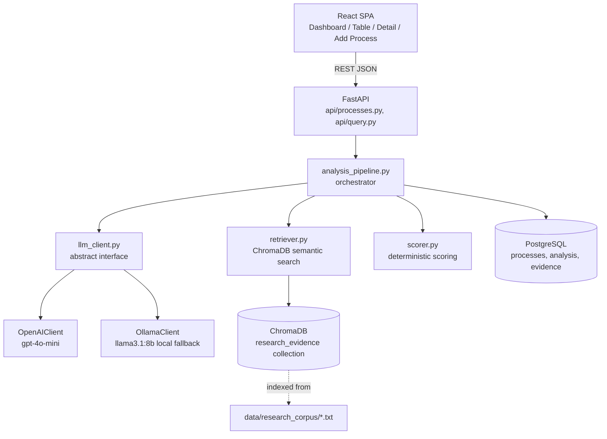

# Architecture

## Layered view (matches the mandatory architecture in the brief)

```
┌─────────────────────────────────────────────────────────────┐
│  USER INTERFACE                                              │
│  React SPA — Dashboard, Process Table, Process Detail,       │
│  Add Process (live "Process 101" form)                       │
└───────────────────────────┬───────────────────────────────────┘
                             │ REST (JSON over HTTP)
┌───────────────────────────▼───────────────────────────────────┐
│  APPLICATION / API LAYER — FastAPI                            │
│  api/processes.py   (create, list, detail)                    │
│  api/query.py        (top-10, human-led, evidence-for-X)      │
│  Input validation, orchestration, error handling               │
└───────────────────────────┬───────────────────────────────────┘
                             │
┌───────────────────────────▼───────────────────────────────────┐
│  AI INTELLIGENCE LAYER                                        │
│  services/analysis_pipeline.py  (orchestrator, one code path  │
│    for seed data AND live evaluator input)                    │
│  ai/llm_client.py    (abstract interface + auto-failover)     │
│  ai/openai_client.py (primary: gpt-4o-mini)                   │
│  ai/ollama_client.py (fallback: local llama3.1:8b, free)      │
│  scoring/scorer.py   (DETERMINISTIC — not LLM-generated)      │
└───────────┬───────────────────────────────┬───────────────────┘
            │                               │
┌───────────▼───────────────┐   ┌───────────▼───────────────────┐
│  DATA & KNOWLEDGE LAYER    │   │  DATA & KNOWLEDGE LAYER        │
│  PostgreSQL                │   │  ChromaDB (local, persistent)  │
│  organisations, processes, │   │  Embedded research corpus,     │
│  process_analysis,         │   │  chunked + embedded via        │
│  evidence_sources,         │   │  sentence-transformers          │
│  process_evidence_links    │   │  (all-MiniLM-L6-v2, free/local)│
└─────────────────────────────┘   └───────────┬───────────────────┘
                                               │
                                 ┌─────────────▼───────────────────┐
                                 │  EXTERNAL RESEARCH / DATA        │
                                 │  Public industry reports          │
                                 │  (McKinsey/Deloitte/NRF/Gartner/  │
                                 │  EY/Forrester/NIST style sources  │
                                 │  — see docs/RESEARCH_SOURCES.md)  │
                                 └───────────────────────────────────┘
```

## Mermaid (renderable in GitHub / most markdown viewers)



## Information Flow (single process, seed or live)

```
Input (name + description)
  → Validate / normalise
  → Store raw process in PostgreSQL
  → Retrieve top-k evidence chunks from ChromaDB (semantic search)
      → if nothing clears relevance threshold: proceed with empty evidence,
        flagged explicitly rather than fabricated
  → LLM produces structured JSON (categorical tags + text only, no scores)
  → scorer.py computes automation_score / priority_score / confidence
      in plain Python — fully deterministic, reproducible
  → Persist ProcessAnalysis + EvidenceSource + ProcessEvidenceLink rows
  → Frontend fetches and displays; dashboard/rankings update immediately
```

## Why this satisfies "not a chatbot wrapper"

1. **Separation of concerns**: the LLM never outputs a number. All scoring
   is Python arithmetic over LLM-provided categorical tags and
   code-computed evidence coverage.
2. **Real retrieval, not memory**: every analysis is grounded in chunks
   pulled from a vector store, with the similarity score persisted for
   audit. Below-threshold evidence is reported as absent, not invented.
3. **One pipeline, many callers**: the exact same Python function handles
   all 100 seed processes and the evaluator's live Process 101 — there is
   no special-cased demo path.
4. **Provider abstraction**: swapping OpenAI for Ollama (or adding a third
   provider) requires writing one new class implementing `LLMClient` —
   nothing else in the codebase changes.
