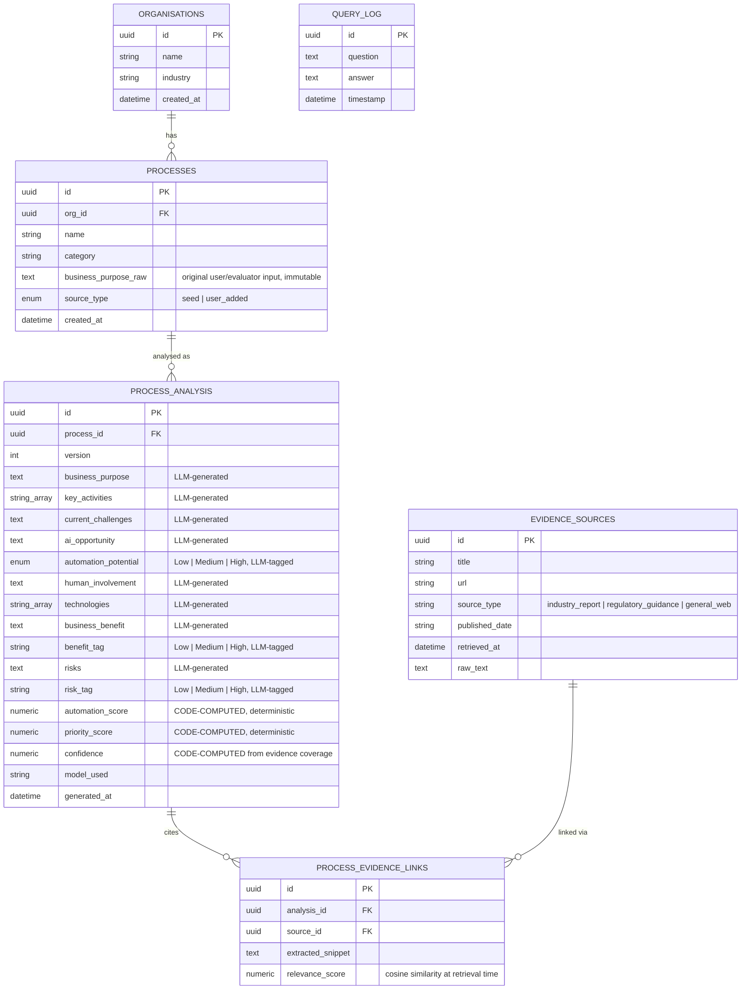

# Data Model / Entity-Relationship Diagram

## ER Diagram (Mermaid — renders natively on GitHub)

## Design rationale

**Why `processes` and `process_analysis` are separate tables, not one:**
The brief requires that the original input and the AI's conclusions be
distinguishable and independently auditable. `processes.business_purpose_raw`
is exactly what was typed in (by the seed script or by an evaluator) and is
never modified. `process_analysis` is versioned (`version` column) so a
process could in principle be re-analysed later (e.g. with a different
model) without losing the history of prior analyses — the API currently
always reads `version == 1`, but the schema doesn't block re-analysis.

**Why scores live as separate numeric columns instead of inside a JSON blob:**
`automation_score` and `priority_score` are computed by Python code
(`scoring/scorer.py`), not by the LLM. Keeping them as first-class indexed
numeric columns means the ranking queries (`ORDER BY priority_score DESC`
in `api/query.py`) are fast, standard SQL — no need to parse JSON or call
the LLM again just to answer "show me the top 10."

**Why evidence is a many-to-many-style link table, not a foreign key on
the analysis row:** A single analysis can (and usually does) cite multiple
evidence sources, and the same evidence source (e.g. one McKinsey report)
gets cited by many different process analyses. `process_evidence_links`
is the join table carrying the per-link `relevance_score`, so the same
source's relevance can differ per process — appropriate since one
document might be highly relevant to "Demand Forecasting" and only
loosely relevant to "Payroll Processing."

**Why `query_log` exists but is barely used yet:** scaffolded for future
traceability of ad-hoc questions asked through the query endpoints — not
required for the current 4 canned queries, but the table exists so this
is a natural extension point rather than a schema change later.

## Vector store (not shown above — lives outside PostgreSQL)

ChromaDB stores the embedded, chunked research corpus separately (see
`research/retriever.py`). It's conceptually a fifth "table" —
`research_evidence` — keyed by chunk ID, holding the chunk text, its
384-dimension embedding vector (from `all-MiniLM-L6-v2`), and metadata
(title, url, source_type, published_date). It is queried at analysis time
but does not participate in foreign-key relationships with PostgreSQL;
the link back to structured data happens in application code
(`services/analysis_pipeline.py`), which takes ChromaDB's results and
writes rows into `evidence_sources` / `process_evidence_links`.

## Source of truth

The actual SQLAlchemy model definitions (the real, authoritative schema)
are in [`backend/models/models.py`](../backend/models/models.py). This
document is a readable companion to that file, not a replacement for it.
